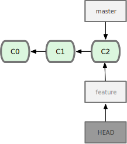
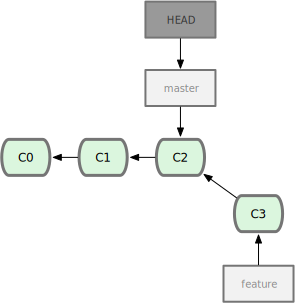

<!-- $theme: gaia -->
<!-- $width: 1440-->
<!-- $height: 900 -->


# 

---

<div style="text-align:center; padding-top: 140px; display: block">


</div>


<div style="text-align:right; margin-right: 100px">

## @oschrenk

</div>

---

# Agenda

---

<!-- page_number: true -->

## What is required

* very elemental knowledge of git
* comfort with command line
* asking questions when they arise

---

## What are we not covering

* underlying data model
* remotes
* workflows
* alternate user interfaces

---

## What are we convering

---

## Basics

## Branching

## Successful merge

## Preparing a merge

## Conflict *during* a merge

## Reverting a merge

---

# Basics

---

# Basics


---

# Basics


---

# Basics

* a `branch` is a pointer to a commit
* `master` is a branch
* `HEAD` is a pointer to the current branch

---

# Branching

---

# Branching

<div style="float: left">

You got a new job!
They want you to build a website.

```sh
$ mkdir great
$ cd great
$ git init
...work...

$ git log --oneline
6bd5150 Add exclamation mark
359a3b3 Add index.html
d8ff412 Initial commit

$ git status
On branch master
nothing to commit, working tree clean
```

</div>

<div style="float: right; margin-top: 150px;">


</div>

---

# Branching

<div style="float: left">

Everybody is happy! 

```html
$ less index.html

<html lang="en">
  <head>
    <meta charset="utf-8">

    <title>gittofoobar</title>
    <meta name="description" content="demo repository">
  </head>

  <body>
    Hello World!
  </body>
</html>
```

</div>

<div style="margin-top: 150px; float: right;">


</div>

---

# Branching

<div style="float: left">

They want you experiment and
use three exclamation marks!

`Hello world!!!`

So you start a new branch.

```sh
$ git branch feature
```

</div>

<div style="margin-top: 0px; float: right;">


</div>

---

# Branching

<div style="float: left">

But wait? Now, there are two branches?
How does `git` know what to point to?
`HEAD` is pointing to the current branch!

</div>

<div style="margin-top: 0px; float: right;">


</div>

---

# Branching

<div style="float: left">

But wait? Now, there are two branches?
How does `git` know what to point to?
`HEAD` is pointing to the current branch!

```sh
$ git checkout feature
Switched to a new branch "feature"
```

</div>

<div style="margin-top: 140px; float: right;">



</div>

---

# Branching

<div style="float: left">

Let's work on that feature!
(and create commit C3)

```sh
$ vim index.html
...work...

$ git add index.html

# git commit --message '...'
$ git commit -m 'Add second exclamation mark'
```
</div>

<div style="margin-top: 140px; float: right;">


</div>

---

# Branching

<div style="float: left">

Oh no! Somebody found an error:

`<title>gittofoobar</title>`

That should be

`<title>gittogreat</title>`

```sh
$ git checkout master
```

</div>

<div style="margin-top: 125px; float: right;">



</div>

---

# Branching

<div style="float: left">

Oh no! Somebody found an error:

`<title>gittofoobar</title>`

That should be

`<title>gittogreat</title>`

```sh
$ git checkout -b hotfix

# git branch hotfix
# git checkout hotfix
```

</div>

<div style="margin-top: 20px; float: right;">


</div>

---

# Branching

<div style="float: left">

Oh no! Somebody found an error:

`<title>gittofoobar</title>`

That should be

`<title>gittogreat</title>`

```sh
$ vim index.html
...work...

# git commit --add --message
$ git commit -a -m 'Fix title'
```

</div>

<div style="margin-top: 20px; float: right;">


</div>

---

# Merging

---

## fast forward
### or
## with merge commit

---

# Fast forward merge

<div style="float: left">

Let's bring the hotfix to production

```sh
$ git checkout master
```

</div>

<div style="margin-top: 0px; float: right;">


</div>

---

# Fast forward merge

<div style="float: left">

Let's bring the hotfix to production

```sh
$ git merge hotfix
Updating f42c576..3a0874c
Fast-forward
 index.html | 2 ++
 1 file changed, 2 insertions(+)
```

</div>

<div style="margin-top: -130px; float: right;">


</div>

---

# Merge commit

<div style="float: left;">

Crisis averted! 
Let's finish the feature.

```sh
$ git checkout feature
Switched to branch "feature"
```
</div>

<div style="margin-top: -100px; float: right;">


</div>

---

# Merge commit

<div style="float: left;">

Crisis averted! 
Let's finish the feature.

But first:
Cleanup after ourselves.

```sh
# git branch --delete hotfix
$ git branch -d hotfix
Deleted branch hotfix (3a0874c)
```
</div>

<div style="margin-top: -100px; float: right;">


</div>

---

# Merge commit

<div style="float: left;">

Crisis averted!
Let's finish the feature.


```sh
$ vim index.html
...work...

$ git commit -a -m 'Add third exclamation mark'
[feature ad82d7a] Add third exclamation mark
1 file changed, 1 insertion(+)
```
</div>

<div style="float: right; margin-right: -00px; margin-top: -580px">


</div>

---

# Merge commit

<div style="float: left;">

Let's bring the feature
to production

```sh
$ git checkout master
Switched to branch 'master'
```

</div>

<div style="margin-top: 0px; margin-right: -20px; float: right;">


</div>

---

# Merge commit

<div style="float: left;">

Let's bring the feature
to production

```sh
$ git merge feature
```

</div>

<div style="margin-top: -120px; margin-right: -20px; float: right;">


</div>

---

# 

---

# Merge commit

What will happen?

<div style="float: left; width: 48%">

```html
<html lang="en">
  <head>
    <meta charset="utf-8">

    <title>gittogreat</title>
    <meta name="description" content="demo repository">
  </head>

  <body>
    Hello World!
  </body>
</html>
```

</div>

<div style="float: right; width: 48%">

```html
<html lang="en">
  <head>
    <meta charset="utf-8">

    <title>gittofoobar</title>
    <meta name="description" content="demo repository">
  </head>

  <body>
    Hello World!!!!!
  </body>
</html>
```

</div>

---

# Merge commit


<div style="float: left;">

It does!

Im my case it opens `vim`
prefilled with the following


```sh
Merge branch 'feature'
```

</div>

<div style="margin-top: -120px; margin-right: -20px; float: right;">


</div>

---

# Merging

<div style="float: left;">

After you saved

```sh
$ git merge feature
Merge made by the 'recursive' strategy.
index.html |    1 +
1 file changed, 1 insertion(+)
```

</div>

<div style="margin-top: -120px; margin-right: -20px; float: right;">


</div>

---

# Merging

Let's look at the log

```
$ git log -1
commit 0b293dd50b6d63e031d475c15f3d6fe162cc95ad
Merge: 2a87139 0da3c2c
Author: Oliver Schrenk <oliver@gittogreat.nl>
Date:   Mon Feb 27 10:38:39 2017 +0100

    Merge branch 'feature'
```

---

# Merging

## 

---

# Work, work.

## `git clone https://github.com/gittogreat/demo`

## Goal:

### Create a succesful merge

---

# 

## You can now merge!

### There are new challenges waiting for you!

---

# Conflicts

---


# What is a conflict?

> A merge conflict happens when two branches both modify the same line of a file and are subsequently merged.

Only you know the intention of the change. 

Git can't.

----

## When can a conflict occur?

All the commands that merge things:

```
$ git merge
$ git pull
# because it does git fetch && git merge

$ git stash pop
$ git stash apply

$ git rebase
$ git cherry-pick

$ git apply
$ git am
```

---

## Prepare for a merge

---

# Cleanup before a Merge

<div style="float: left;">

We had some uncommited changes

```sh
$ git status --short
 M index.html
 
$ git merge feature
```

What happens?

</div>

<div style="margin-top: -400px; float: right;">


</div>

---

# Cleanup before a Merge

```
$ git merge feature
Updating 6bd5150..f23f994
error: Your local changes to the following files would be overwritten by merge:
        index.html
Please commit your changes or stash them before you merge.
Aborting
```

Ouch.

---

## Commit the changes
## Discard the changes
## Stash the changes

---

# Commit the changes

```sh
$ git add index.html
$ git commit
```

---

# Discard the changes

<div style="float: left;  width: 45%"">

Unstaged changes. 

This is destructive!

```sh
$ git checkout index.html
```

</div>

<div style="float: right; width: 45%">

Staged changes. 

This is destructive!

```sh
$ git reset index.html
$ git checkout index.html
```

</div>

---

# Stash the changes

<div style="float: left;">

```sh
$ git status --short
 M index.html

$ git stash
                                        
$ git status --short
```

</div>

<div style="float: right; margin-top: -100px">


</div>

---

# Stash the changes

And after the merge:

<div style="float: left;  width: 45%">

```sh
$ git stash apply
     
$ git status --short
 M index.html
```

Of course applying the stash might
result in a merge conflict.

</div>

<div style="float: right; margin-top: -197px">


</div>

---

# Merge conflict

---

# Populate the repository

<div style="float: left; width: 45%">

Let's make a new repo

```sh
$ git init conflict
$ cd conflict
$ touch hello.rb
```

with the content
```
#! /usr/bin/env ruby

def hello
  puts 'hello world'
end

hello()
```

</div>

<div style="float: right; width: 47%">

Make it executable

```sh
chmod u+x hello.rb
```

and make initial commit

```sh
$ git add hello.rb
$ git commit -m "Initial commit"
```

</div>

---

# Populate the repository

Create `whitespace` branch and work on that.
Make some whitespace changes.

```sh
$ git branch whitespace
$ git checkout whitespace
Switched to a new branch 'whitespace'

# brew install dos2unix
# download at http://waterlan.home.xs4all.nl/dos2unix.html
# or have editor that can change line endings of a file
$ unix2dos hello.rb
unix2dos: converting file hello.rb to DOS format ...

$ git add hello.rb
$ git commit -m 'Convert to DOS line ending'
[whitespace d491487] Convert to DOS line ending
 1 file changed, 7 insertions(+), 7 deletions(-)
```

---

# Merge conflict

```diff
# Change `world` to `mundo`
$ sed -i '' 's/world/mundo/' hello.rb

$ git diff
diff --git a/hello.rb b/hello.rb
index f3152d9..e85207e 100755
--- a/hello.rb
+++ b/hello.rb
@@ -1,7 +1,7 @@
 #! /usr/bin/env ruby

 def hello
-  puts 'hello world'
+  puts 'hello mundo'^M
 end

 hello()
```
---

# Sidequest

## Reading diff

---

# Reading diff

```
diff --git a/hello.rb b/hello.rb
index f3152d9..e85207e 100755
--- a/hello.rb
+++ b/hello.rb
@@ -1,7 +1,7 @@
 #! /usr/bin/env ruby

 def hello
-  puts 'hello world'
+  puts 'hello mundo'^M
 end

 hello()
```

---

# Reading diff

```
diff --git a/hello.rb b/hello.rb
index f3152d9..e85207e 100755
--- a/hello.rb
+++ b/hello.rb
@@ -1,7 +1,7 @@
 #! /usr/bin/env ruby

 def hello
-  puts 'hello world'
+  puts 'hello mundo'^M
 end

 hello()
```

`--git` marker that we are running git version of diff.
`a/` `b/`are directories, they are not real.
`9fb48b8..f2ce88f 100755` index id of both files and mode bits

---

# Reading diff

```
diff --git a/hello.rb b/hello.rb
index f3152d9..e85207e 100755
--- a/hello.rb
+++ b/hello.rb
@@ -1,7 +1,7 @@
 #! /usr/bin/env ruby

 def hello
-  puts 'hello world'
+  puts 'hello mundo'^M
 end

 hello()
```

`--- a/file` Appears in `a` but removed in `b`
`+++ b/file` Missing in `a` but added to `b`

---

# Reading diff

```
diff --git a/hello.rb b/hello.rb
index f3152d9..e85207e 100755
--- a/hello.rb
+++ b/hello.rb
@@ -1,7 +1,7 @@
 #! /usr/bin/env ruby

 def hello
-  puts 'hello world'
+  puts 'hello mundo'^M
 end

 hello()
```

`@@ -1,7 +1,7 @@` indicates start of a difference section, aka `hunk`
`-1,7 +1,7` hunk starts at line 1, ends at line 7 in both versions

---

# Reading diff

```
diff --git a/hello.rb b/hello.rb
index f3152d9..e85207e 100755
--- a/hello.rb
+++ b/hello.rb
@@ -1,7 +1,7 @@
 #! /usr/bin/env ruby

 def hello
-  puts 'hello world'
+  puts 'hello mundo'^M
 end

 hello()
```

`-this line will be deleted` Appears in `a` but removed in `b`
`+this line is added` Missing in `a` but added to `b`

---

# 

## You can now read diffs!

### There are new challenges waiting for you!

---

# Merge conflict

Let's finalize the work on the `whitespace` branch

```diff
$ git commit -am 'Change world to mundo'
```

---

# Merge conflict

Let's go back to the `master` branch
and comment the function

```sh
$ git checkout master
Switched to branch 'master'

$ vim hello.rb
...work...
```

---

# Conflict during a Merge

```
$ git diff
diff --git a/hello.rb b/hello.rb
index ac51efd..36c06c8 100755
--- a/hello.rb
+++ b/hello.rb
@@ -1,5 +1,6 @@
 #! /usr/bin/env ruby

+# prints out a greeting
 def hello
   puts 'hello world'
 end
 
$ git add hello.rb 
$ git commit -m 'Add documentation'
```

---

# Conflict during a Merge

<div style="float: left">

Where are we?

`c0` Intial commit
`c2` Convert to DOS line ending
`c3` Change world to mundo
`c1` Add documentation

</div>

<div style="margin-top: 0px; float: right;">


</div>

---

# Conflict during a Merge

<div style="float: left">

We want to merge
`whitespace` into `master`

```sh
$ git merge whitespace
```

What will happen?

</div>

<div style="margin-top: 0px; float: right;">


</div>

---

# Conflict during a Merge

We want to merge
`whitespace` into `master`

```sh
$ git merge whitespace
Auto-merging hello.rb
CONFLICT (content): Merge conflict in hello.rb
Automatic merge failed; fix conflicts and then commit the result.
```

---

# Question 

## Why was there a conflict?

---

# Breathe

---

## Decide not to merge

## or

## Resolve the conflicts.

---

# Decide not to merge

---

# Decide not to merge

Cleanup.

```shell
$ git merge --abort
```

1. Set `HEAD` back to master
2. Clean up working tree.

---

# Resolve the conflicts

## 

---

# Breathe

---

# Resolve the conflicts.

Let's deal with it

```sh
$ git merge whitespace
Auto-merging hello.rb
CONFLICT (content): Merge conflict in hello.rb
Automatic merge failed; fix conflicts and then commit the result.
```

---

## Identify affected files

## Identify changes to each file

## Get more context

## Resolve conflict per file

## Lint and Test

---

# Identify affected files

---

# Identify affected files

Command: `git status`

```shell
$ git status
On branch master
You have unmerged paths.
  (fix conflicts and run "git commit")
  (use "git merge --abort" to abort the merge)

Unmerged paths:
  (use "git add <file>..." to mark resolution)

        both modified:   hello.rb

no changes added to commit (use "git add" and/or "git commit -a")

$ git status --short
UU hello.rb
```

---

# Identify changes to each file

---

# Identify changes to each file

<div style="float: left; width: 48%;">

```sh
$ git diff
diff --cc hello.rb
index fa7487c,f2ce88f..0000000
--- a/hello.rb
+++ b/hello.rb
...

# continues on the right
```

Spot the diff!

</div>

<div style="float: right; width: 48%;">

```sh
# continuing from the left
@@@ -1,6 -1,5 +1,14 @@@
++<<<<<<< HEAD
 +#! /usr/bin/env ruby
 +
 +# prints out a greeting
 +def hello
 +  puts 'hello world'
 +end
++=======
+ #! /usr/bin/env ruby
+
+ def hello
+   puts 'hello mundo'
+ end
++>>>>>>> whitespace
```

</div>

---

# Identify changes to each file

<div style="float: left; width: 48%;">

```sh
$ git diff
diff --cc hello.rb
index fa7487c,f2ce88f..0000000
--- a/hello.rb
+++ b/hello.rb
...

# continues on the right
```

* 3 ranges `-1,6 -1,5 +1,14`
* two columns with `+`/`-`
* markers `<<<<<<<`, `=======`, and `>>>>>>>`


</div>

<div style="float: right; width: 48%;">

```sh
# continuing from the left
@@@ -1,6 -1,5 +1,14 @@@
++<<<<<<< HEAD
 +#! /usr/bin/env ruby
 +
 +# prints out a greeting
 +def hello
 +  puts 'hello world'
 +end
++=======
+ #! /usr/bin/env ruby
+
+ def hello
+   puts 'hello mundo'
+ end
++>>>>>>> whitespace
```

</div>

---

# Identify changes to each file

We are diffing the merge from two files against `HEAD`

We have two `from` ranges `-1,6 -1,5` and one `to` range `+1,14`

The `+` columns indicate the diff for each `from` file


<div style="float: left; width: 48%;">

```sh
$ git diff
diff --cc hello.rb
index fa7487c,f2ce88f..0000000
--- a/hello.rb
+++ b/hello.rb

...

# continues on the right
```

</div>

<div style="float: right; width: 48%;">

```sh
# continuing from the left
@@@ -1,6 -1,5 +1,14 @@@
...
 +  puts 'hello world'
 +end
++=======
+ #! /usr/bin/env ruby
+
...
```

</div>

---

# Identify changes to each file

<div style="float: left; width: 56%;">

* top half is the branch you are merging into (we are on `master`)
* bottom half is from the commit that you are merging in

In practice (for merges):

* from `<<<<<<<` to `=======` are local changes
* from `=======` to `>>>>>>>` are remote changes

</div>

<div style="float: right; width: 42%;">

```sh
++<<<<<<< HEAD
 +#! /usr/bin/env ruby
 +
 +# prints out a greeting
 +def hello
 +  puts 'hello world'
 +end
++=======
+ #! /usr/bin/env ruby
+
+ def hello
+   puts 'hello mundo'
+ end
++>>>>>>> whitespace
```

</div>

---

# Identify changes to each file

<div style="float: left">

Ouch. What we wanted to see:

```
#! /usr/bin/env ruby

def hello
<<<<<<< HEAD
  +# prints out a greeting
=======
  -   puts 'hello world'
  +   puts 'hello mundo'
>>>>>>> whitespace
```

But normally you don't have the luxury 
to know what should be there.

</div>

<div style="margin-top: -120px; float: right;">


</div>

---

# Get more context

---

## communicate
## set conflictstyle
## list involved commits
## show different versions

---

# Communicate

Plan ahead.

* set a common codestyle
* separate formatting change commits from code change commits
* make small commits
* make readable commits
* create small work units
* release often

---

# Communicate

Talk with your co-workers.

* talk to the person if you know she works on the same files
* it might save you time to work serially
* if you can't, merge often

---

# Technical solutions

# 

---

# Set conflictstyle

What is missing here?

<div style="float: left; width: 40%;">

```sh
++<<<<<<< HEAD
 +#! /usr/bin/env ruby
 +
 +# prints out a greeting
 +def hello
 +  puts 'hello world'
 +end
++=======
+ #! /usr/bin/env ruby
+
+ def hello
+   puts 'hello mundo'
+ end
++>>>>>>> whitespace
```

</div>

<div style="float: right; margin-top: -210px;">


</div>

---

# Set conflictstyle

<div style="float: left; width: 45%;">

```
# git merge --abort
# default conflictstyle is `merge`
$ git config merge.conflictstyle diff3
$ git merge whitespace
```

We gain `|||||||` marker

```
<<<<<<< master
+  puts 'hola world'
|||||||
+  puts 'hello world'
=======
+  puts 'hello mundo'
>>>>>>> spanish
```

</div>

<div style="float: right; margin-top: -150px;">


</div>

---

# List involved commits

List all involved commits for this merge 

```
# git log --merge --patch [path]
$ git log --merge -p [path]
```

List all involved commits for this merge from the current branch

```
# git log HEAD..feature --patch [path]
$ git log ..feature -p [path]
```

List all involved commits for this merge from the feature branch

```
# git log feature..HEAD --patch [path]
$ git log feature.. -p [path]
```
---

# Show different versions

<div style="float: left">

Show each involved version

* `stage 1` common ancestor (`c0`)
* `stage 2` our version (`c1`)
* `stage 3` their version (`c3`)

```sh
$ git show :1:hello.rb
$ git show :2:hello.rb
$ git show :3:hello.rb
```

</div>

<div style="margin-top: -120px; float: right;">


</div>

---

# Show different versions

It's especially useful to write these contents out

```sh
$ git show :1:hello.rb > hello.common.rb
$ git show :2:hello.rb > hello.ours.rb
$ git show :3:hello.rb > hello.theirs.rb
```

Edit them, and manually merge the single file

```sh
# -p sends output to standard output
# git merge-file <current-file> <base-file> <other-file>
$ git merge-file -p \
    hello.ours.rb hello.common.rb hello.theirs.rb > hello.rb
```

---

# Resolve the conflict

---

# Merge Manually

To fix the merge we need to `dos2unix` and

1. Get copy of my version, their version, and ancestor version
2. Fix their side, and retry merge

---

# Merge Manually

<div style="float: left">

Let's create these files

* `stage 1`  common ancestor (`c0`)
* `stage 2`  our version (`c1`)
* `stage 3`  their version (`c3`)

```sh
$ git show :1:hello.rb > hello.common.rb
$ git show :2:hello.rb > hello.ours.rb
$ git show :3:hello.rb > hello.theirs.rb
```

</div>

<div style="margin-top: -120px; float: right;">


</div>

---

# Merge Manually

We fix the whitespace using `dos2unix`

```sh
$ dos2unix hello.theirs.rb
dos2unix: converting file hello.theirs.rb to Unix format ...

$ git merge-file -p \
    hello.ours.rb hello.common.rb hello.theirs.rb > hello.rb
```

---

# Merge Manually

Let's take a look a the diff

```
# git diff
$ git diff
diff --cc hello.rb
index 36c06c8,e85207e..0000000
--- a/hello.rb
+++ b/hello.rb
@@@ -1,8 -1,7 +1,8 @@@
  #! /usr/bin/env ruby
 +# prints out a greeting
  def hello
-   puts 'hello world'
+   puts 'hello mundo'
  end
```

---

# Lint and Test

---

# Merge Manually

Clean up

```shell
# git clean --force
$ git clean -f
Removing hello.common.rb
Removing hello.ours.rb
Removing hello.theirs.rb
```

---

# Merge Manually

Finish

```sh
$ git add hello.rb
$ git commit
[master 40b3466] Merge branch 'whitespace'
```

---

# Work, work.

## Goal: Merge feature into master

### `git clone https://github.com/gittogreat/work-conflict`

---

# Goal: Merge feature into master

<div style="float: left; width: 50%; margin-top: -60px">

1. Communicate

2. Set conflictstyle

```
# git merge --abort
# default conflictstyle is `merge`
$ git config merge.conflictstyle diff3
$ git merge whitespace
```

3. Show versions

```
$ git show :1:hello.rb > common.rb
$ git show :2:hello.rb > ours.rb
$ git show :3:hello.rb > theirs.rb
# git merge-file -p \
#   ours.rb common.rb theirs.rb > hello.rb
```

</div>

<div style="float: right; width: 48%; margin-top: -60px">

4. List history

```sh
# all commits for this merge
# git log --merge --patch [path]
$ git log --merge -p [path]
```

```sh
# commits from the current branch
# git log HEAD..feature --patch [path]
$ git log ..feature -p [path]
```

```sh
# commits from the feature branch
# git log feature..HEAD --patch [path]
$ git log feature.. -p [path]
```

5. Lint and Test

</div>

---

# 

## You can now resolve diffs!

### There are new challenges waiting for you!

---

# Undoing Merges

---

# Undoing Merges

<div style="float: left; margin-top: -20px;">

> Oh s***. I screwed up the merge.

That is OK. That's why we have Git.

## Two scenarios:

1. You did not push
2. You pushed

</div>

<div style="margin-top: -430px; float: right;">


</div>

---

# Undoing unpushed merge

---

# Undoing unpushed merge

<div style="float: left; margin-top: 30px;">

Move `master` and HEAD to `C4`
Delete `M`

```sh
$ git reset --hard HEAD~
```

</div>

<div style="margin-top: -240px; float: right;">


</div>

---

# Undoing pushed merge

---

# Undoing pushed merge

Public commits are immutable!

Reverting merge pushed commits is bothersome!

```
git revert HEAD
fatal: Commit 137ea95 is a merge but no -m option was given.
```

---

# Undoing pushed merge

Remember that a merge consists of (at least) two commits:

```
$ git log HEAD -1
commit 40b34665cf6e61d4867781fcab89de7765af5fad
Merge: 2f6a157 bb70738
Author: Oliver Schrenk <oliver.schrenk@gmail.com>
Date:   Wed Mar 1 01:39:37 2017 +0100

    Merge branch 'whitespace'

```

---

# Undoing pushed merge

<div style="float: left;">

Choose the right mainline, starting with 1

```sh
$ git revert HEAD --mainline 1
[master b1d8379] Revert "Merge branch 'feature'"
```
* `^M` has exactly the same contents as `C4`

</div>

<div style="margin-top: -260px; float: right;">


</div>

---

# Undoing pushed merge

<div style="float: left;">

What happens if you try to merge again?

```sh
$ git merge feature	
Already up-to-date.
```

</div>

<div style="margin-top: -180px; float: right;">


</div>

---

# Undoing pushed merge

<div style="float: left;">

Even worse, it would only merge new changes!

```sh
$ git merge feature	
Already up-to-date.
```

</div>

<div style="margin-top: -180px; float: right;">


</div>

---

# Undoing pushed merge

<div style="float: left;">

Un-revert the original merge

```sh
$ git revert ^M
[master 09f0126] Revert "Revert "Merge branch 'feature'""
```

</div>

<div style="margin-top: -215px; float: right;">


</div>

---

# Undoing pushed merge

<div style="float: left;">

Un-revert the original merge

```sh
$ git merge feature
```

</div>

<div style="margin-top: -215px; float: right;">


</div>

---

# Work, work.

## Undo the merge you did

## Imagine you pushed it already

---

# 

## You can now revert merges!

---


# 

---

# Questions